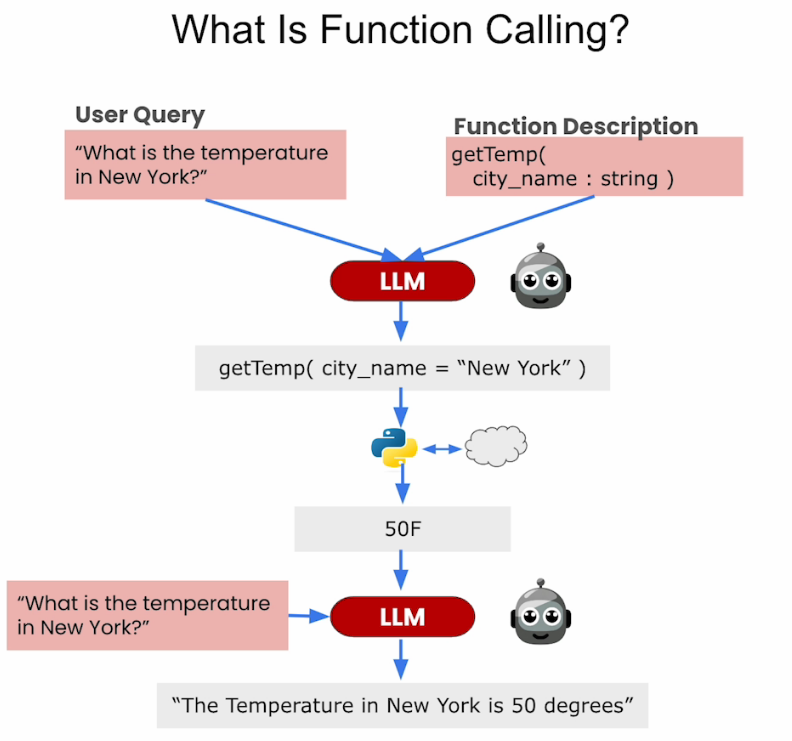

# 📊 [Function-calling and Data Extraction with LLMs](https://www.deeplearning.ai/short-courses/function-calling-and-data-extraction-with-llms/)

💡 Welcome to the "Function-calling and Data Extraction with LLMs" course! The course will equip you with the critical skills for building advanced applications with LLMs.

## Course Summary
In this course, you'll dive into the essentials of function-calling and structured data extraction with LLMs, focusing on practical applications and advanced workflows. Here's what you can expect to learn and experience:

1. 🛠️ **Function-calling**: Learn to extend LLMs with custom capabilities by enabling them to call external functions based on natural language instructions, using NexusRavenV2-13B, an open-source model fine-tuned for function-calling and data extraction.

2. 🔄 **Complex Workflows**: Work with multiple function calls, including parallel and nested calls, to create complex agent workflows where an LLM plans and executes a series of functions to achieve a goal.
3. 🌐 **Web Services Integration**: Use OpenAPI specifications to build function calls that can access web services, enhancing the functionality and reach of your applications.
4. 🗂️ **Structured Data Extraction**: Extract structured data from natural language inputs, enabling real-world data usability for analysis and application.

5. 💾 **End-to-End Application**: Build an application that processes customer service transcripts, generates SQL calls, and stores results in a database, demonstrating the practical implementation of the skills learned.

## Key Points
- 🔌 **Extend LLM Functionality**: Learn to extend LLMs with custom functionality via function-calling, enabling them to perform external function calls.
- 📊 **Data Usability**: Extract structured data from natural language inputs, making real-world data usable for analysis.
- 🛠️ **Practical Implementation**: Build an end-to-end application that processes customer service transcripts using LLMs.

## About the Instructors
🌟 **Jiantao Jiao** is the Co-founder & CEO of Nexusflow and an Assistant Professor of EECS and Statistics at UC Berkeley, bringing extensive expertise in function-calling and data extraction.

🌟 **Venkat Srinivasan** is a Founding Engineer at Nexusflow, specializing in the development of advanced LLM applications.

🔗 To enroll in the course or for further information, visit [deeplearning.ai](https://www.deeplearning.ai/short-courses/).
